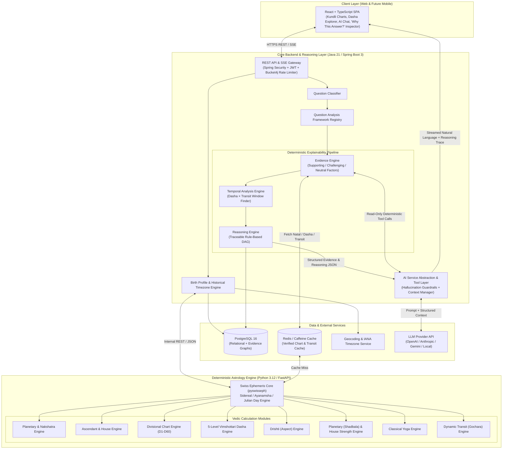
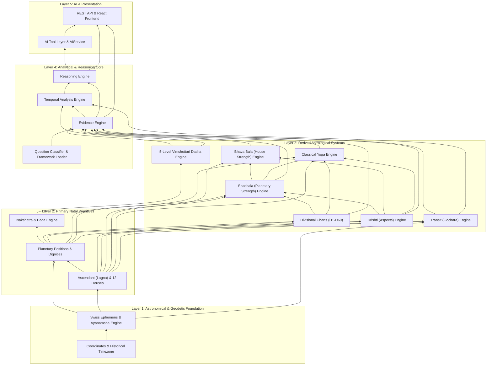

# Astro-AI: Production-Ready AI-Powered Vedic Astrology / Kundli Platform
## Master Technical Architecture & Specification (Phase 0)

---

## 1. Core Architectural Principle

**THE LLM MUST NEVER BE THE ASTROLOGY CALCULATION ENGINE.**

All astronomical positions, house cusps, nakshatras, divisional charts (D1–D60), 5-level Vimshottari Dashas, Graha/Rashi Drishti, Shadbala, Bhava Bala, Classical Yogas, and Gochara (Transits) are computed deterministically by the isolated **Astrology Calculation Engine**.

The **Evidence Engine** and **Reasoning Engine** evaluate explicit astrological rules over those deterministic outputs to produce a structured, traceable **Evidence Graph** and **Reasoning Chain**. The **AI Service (LLM)** only translates that verified structured data into natural language and invokes deterministic read-only tools for follow-up exploration.

```text
                         USER
                           │
                           ▼
                    React Frontend
                           │
                           ▼
              Spring Boot Backend API
                           │
                           ▼
                  Question Classifier
                           │
                           ▼
               Question Analysis Framework
                           │
                           ▼
         Python Astrology Calculation Engine (Swiss Ephemeris)
                           │
             ┌─────────────┼─────────────┐
             │             │             │
             ▼             ▼             ▼
          Charts         Dashas       Transits
             │             │             │
             ├─────────────┼─────────────┤
             │             │             │
             ▼             ▼             ▼
         Drishti       Strengths       Yogas
             │             │             │
             └─────────────┼─────────────┘
                           ▼
                     Evidence Engine
                           │
                           ▼
                    Reasoning Engine
                           │
                           ▼
                       LLM / AI
                           │
                           ▼
                 Natural Language Answer
```

---

## 2. System Architecture Diagram



---

## 3. Monorepo Structure

```text
astro-ai/
├── frontend/                  # React 18 + TypeScript + Vite + Tailwind CSS
├── backend/                   # Java 21 + Spring Boot 3 + Spring Security + JPA
├── astrology-engine/          # Python 3.12 + FastAPI + Swiss Ephemeris (pyswisseph)
├── ai-service/                # Prompt templates, tool schemas, AI evaluation suite
├── database/                  # PostgreSQL initialization & backup scripts
├── docs/                      # ASTROLOGY_SPECIFICATION.md, database-er.md, API docs
├── tests/                     # E2E integration & golden chart validation suites
├── docker/                    # Multi-stage Dockerfiles & Nginx configuration
├── scripts/                   # Development & verification automation scripts
├── .env.example
├── docker-compose.yml
├── README.md
├── ARCHITECTURE.md
└── CONTRIBUTING.md
```

---

## 4. Module Dependency Graph



---

## 5. Development Phases Roadmap

- **Phase 0**: Requirements, Architecture, and Astrological Specification Review
- **Phase 1**: Repository setup and development environment
- **Phase 2**: Birth profile and location/timezone engine
- **Phase 3**: Astronomical calculation engine
- **Phase 4**: Ascendant + house engine
- **Phase 5**: D1 chart engine and visualization
- **Phase 6**: Nakshatra engine
- **Phase 7**: 5-Level Vimshottari Dasha engine
- **Phase 8**: Divisional charts (D1–D60 Shodashavarga)
- **Phase 9**: Drishti (Aspects) engine
- **Phase 10**: Planetary strength (Shadbala) engine
- **Phase 11**: House strength (Bhava Bala) engine
- **Phase 12**: Classical Yoga engine
- **Phase 13**: Transit (Gochara) engine
- **Phase 14**: Temporal analysis engine
- **Phase 15**: Question classifier and analysis frameworks
- **Phase 16**: Evidence engine
- **Phase 17**: Reasoning engine
- **Phase 18**: AI tool layer and provider abstraction
- **Phase 19**: AI chatbot and "Why This Answer?" explainability UI
- **Phase 20**: Authentication and authorization
- **Phase 21**: Saved profiles and conversation history
- **Phase 22**: Unit, integration, golden reference, and AI evaluation testing
- **Phase 23**: Security hardening and privacy controls
- **Phase 24**: Performance and caching optimization
- **Phase 25**: Production deployment configuration
- **Phase 26**: Observability, monitoring, and maintenance
