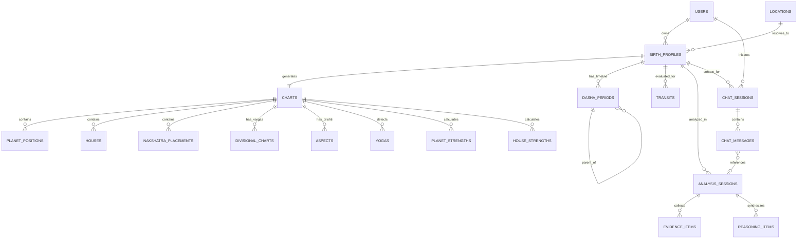

# Database Entity-Relationship Specification (`database-er.md`)

```mermaid
erDiagram
    USERS ||--o{ BIRTH_PROFILES : owns
    USERS ||--o{ CHAT_SESSIONS : initiates
    LOCATIONS ||--o{ BIRTH_PROFILES : resolves_to
    BIRTH_PROFILES ||--|| CHARTS : generates
    BIRTH_PROFILES ||--o{ DASHA_PERIODS : has_timeline
    BIRTH_PROFILES ||--o{ TRANSITS : evaluated_for
    BIRTH_PROFILES ||--o{ ANALYSIS_SESSIONS : analyzed_in
    BIRTH_PROFILES ||--o{ CHAT_SESSIONS : context_for

    CHARTS ||--o{ PLANET_POSITIONS : contains
    CHARTS ||--o{ HOUSES : contains
    CHARTS ||--o{ NAKSHATRA_PLACEMENTS : contains
    CHARTS ||--o{ DIVISIONAL_CHARTS : has_vargas
    CHARTS ||--o{ ASPECTS : has_drishti
    CHARTS ||--o{ YOGAS : detects
    CHARTS ||--o{ PLANET_STRENGTHS : calculates
    CHARTS ||--o{ HOUSE_STRENGTHS : calculates

    DASHA_PERIODS ||--o{ DASHA_PERIODS : parent_of
    ANALYSIS_SESSIONS ||--o{ EVIDENCE_ITEMS : collects
    ANALYSIS_SESSIONS ||--o{ REASONING_ITEMS : synthesizes
    CHAT_SESSIONS ||--o{ CHAT_MESSAGES : contains
    CHAT_MESSAGES }o--o| ANALYSIS_SESSIONS : references
```
